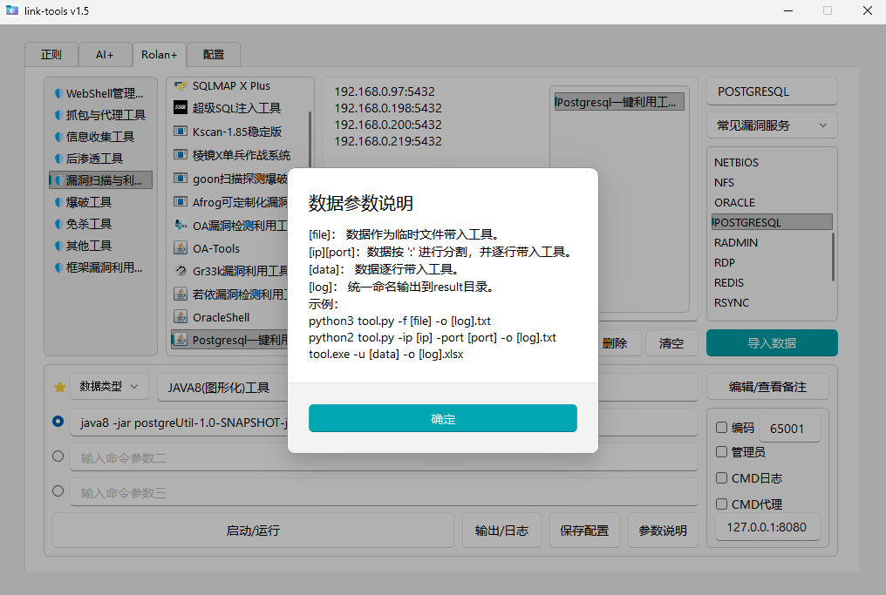
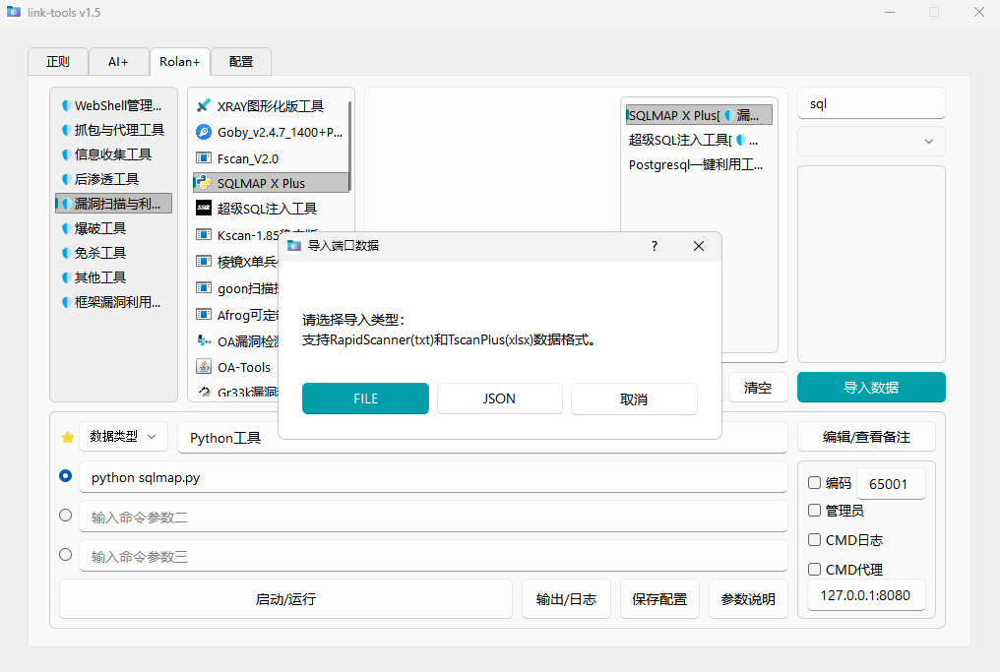
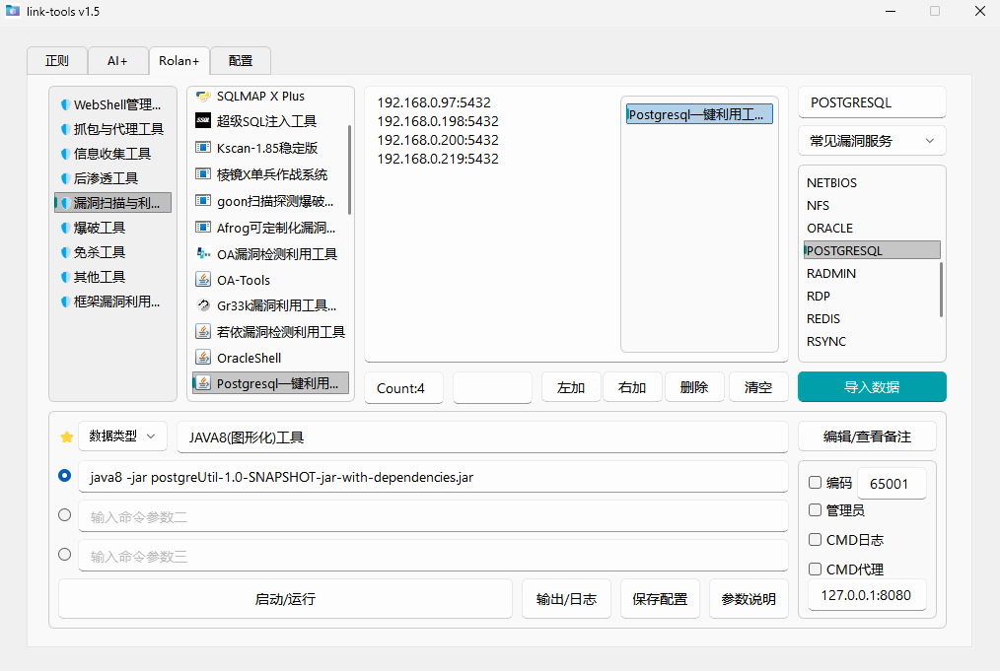
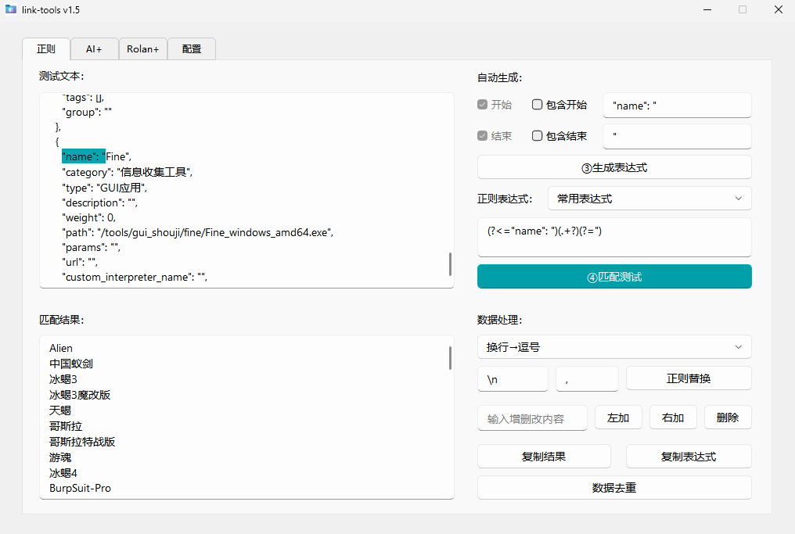
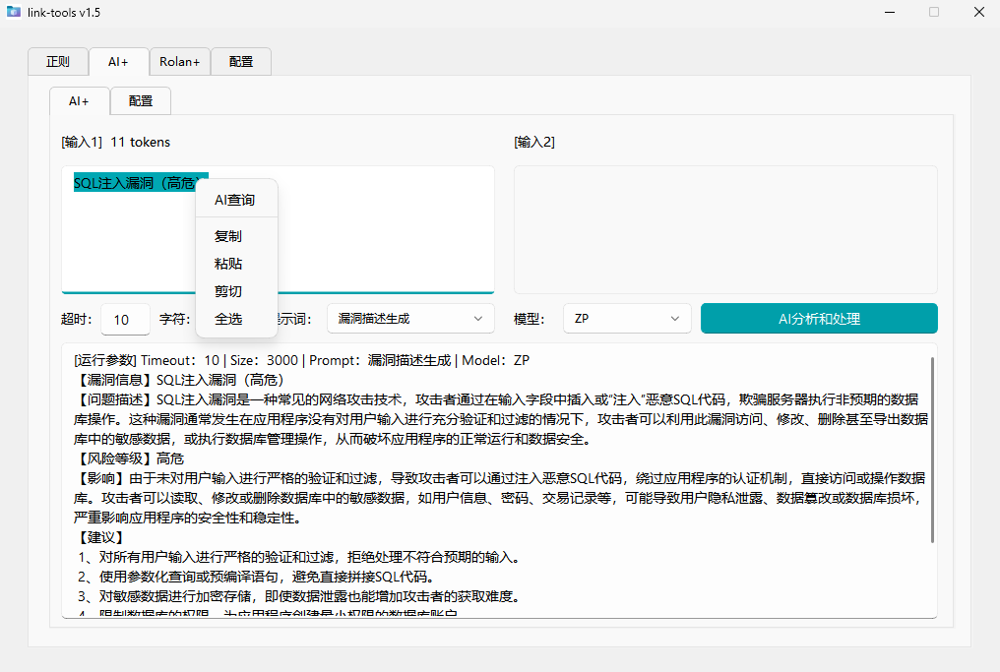
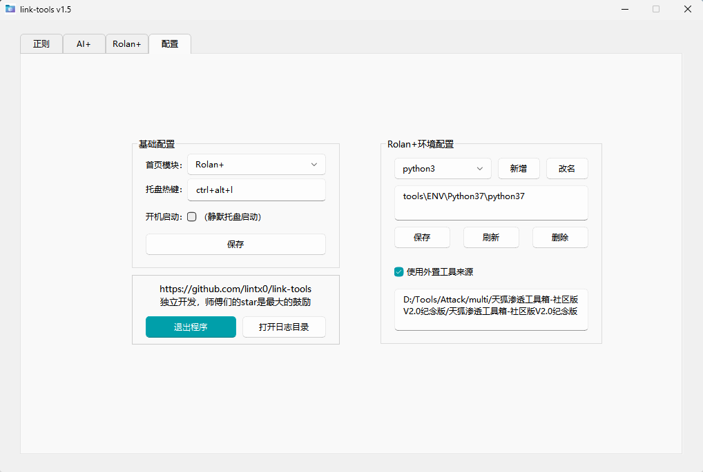

# 🔗 link-tools v1.5

> 一款Windows GUI界面的渗透测试工具箱，以 Rolan+ 参数化工具启动器为核心，集成正则表达式处理、AI 智能分析等功能。支持 TscanPlus(xlsx) 端口扫描结果导入快速联动工具，支持天狐工具箱工具导入实现快速部署，提升安全测试和渗透工作的效率。

---

## 🚀 核心功能

### ⭐ Rolan+ 工具启动器

#### 🔧 核心功能

**参数化批量启动**

- 支持参数占位符：`[file]`、`[ip]`、`[port]`、`[data]`、`[log]`
- 通过 bat 分割循环实现批量执行，让原本无法批量运行的工具也能批量启动
- 一次配置，自动循环处理所有数据，大幅提升批量测试效率
- 支持三条命令参数配置，灵活适应不同工具需求

#### ⚡ 重点功能

**数据导入与工具联动**

- 支持导入 RapidScanner(txt) 和 TscanPlus(xlsx) 端口扫描结果
- 自动识别服务类型，分类为"常见漏洞服务"和"其他服务"
- 生成结构化 JSON 和 Excel 分析报告
- 快速筛选目标服务，一键加载到数据框
- 根据数据类型智能推荐相关工具，实现数据与工具的快速联动

**工具拖拽新增**

- 直接拖拽文件或目录到工具列表即可快速添加工具
- 自动识别工具类型，自动设置图标
- 支持文件、目录、jar 包、Python 脚本等多种工具类型

**外置工具源导入**

- 支持一键导入外部工具集（目前支持天狐渗透工具箱）
- 自动解析工具配置，批量导入工具和分组
- 自动识别工具类型（Java8/Java11/Python/命令行），自动配置运行环境

#### 📦 其他功能

- **分组管理**：支持工具分组，使用 Emoji 表情标识
- **快速启动**：双击工具即可启动
- **智能搜索**：支持工具名称和描述的模糊搜索，快捷键唤醒时自动聚焦
- **批量数据处理**：支持 IP、URL、IP+PORT 等多种数据类型，左加、右加、删除、清空等批量编辑
- **环境配置**：支持自定义环境变量，管理 Java、Python 等运行环境
- **运行日志**：自动记录工具运行日志，支持 CMD 日志输出
- **快速迁移**：支持内置工具、内置环境部署，当工具添加时会判断是否在link-tools工具箱目录下，如果在目录下会实现相对路径调用，结合相对路径环境变量配置可实现快速迁移部署专属工具箱

### 🔍 正则表达式工具

- **智能表达式生成**：根据开始和结束关键字自动生成正则表达式
- **实时匹配测试**：支持正则表达式实时匹配和结果预览
- **常用表达式库**：内置 IP、端口、手机号、身份证等常用正则模板
- **数据批量处理**：支持左加、右加、删除、正则替换、去重等批量操作
- **智能排序**：自动识别 IP 地址、数字、字母等格式进行智能排序

### 🤖 AI+ 智能分析

- **全局 AI 菜单**：在任何文本组件中选中文本，右键即可快速调用 AI 分析
- **多模型支持**：支持 OpenAI 兼容 API（DeepSeek、腾讯云、阿里云、硅基流动等）和 Ollama 本地部署
- **自定义提示词**：支持创建、编辑、管理提示词模板
- **双输入支持**：支持两个输入框，满足复杂分析场景
- **流式输出**：实时显示 AI 分析结果，支持中断操作

**内置提示词模板**：AI 对话、完善表达、漏洞描述生成、AI 代码审计、WEBSHELL 检测、HTTP 流量分析、编码分析、进程分析、JavaScript 分析、HTTP 转 Python、文本格式转换、正则表达式生成、语言翻译、漏洞说明生成、漏洞分析优化模型、应急响应优化提示词等

### ⌨️ 系统托盘与快捷键

- **系统托盘**：最小化到系统托盘，不占用任务栏空间
- **全局快捷键**：支持自定义全局快捷键（默认 `Ctrl+Alt+L`），随时唤醒
- **单实例运行**：防止程序重复启动
- **开机启动**：支持开机自动启动（静默模式）

---

## 📝 更新日志 V1.5

1. **全面优化 UI 界面**
2. **新增工具模糊搜索**（采用工具名称和备注信息中检索）
3. **新增 TscanPlus(xlsx) 端口扫描数据导入**
4. **新增全局 AI 查询**（工具箱中任意位置选中文本，右键即可调用 AI 分析）
5. **新增外置工具来源导入**（目前仅支持导入天狐工具箱工具）
6. **新增环境变量配置**（配置相对路径可部署为内置环境工具箱）
7. **新增开机静默启动、系统托盘、全局快捷键**

---

## 🙏 致谢

独立开发，师傅们的 star 是最大的鼓励 ⭐

